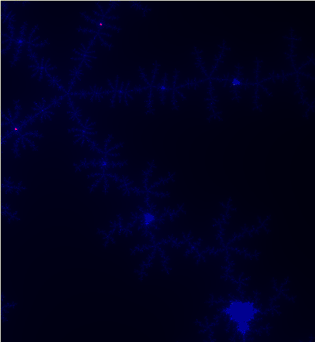
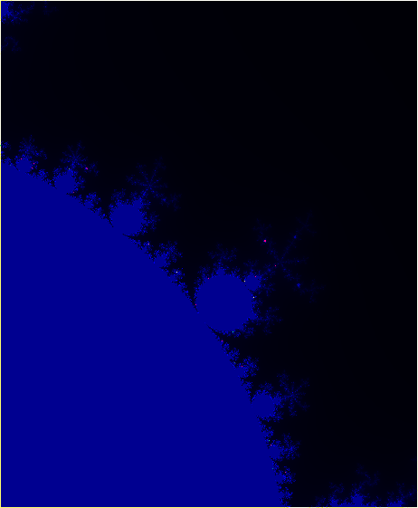

# mandelbrotsetc
A realtime calculation and rendering of the mandelbrot  set with mouse wheel zoom and drag and drop navigation, implemented in SFML

# Calculation
For each point c in the complex plane, the recursive equation  
z<sub>n+1</sub> = z<sub>n</sub><sup>2</sup> + c  
is calculated iteratively, and the point in the complex grid is colorized by the rate of divergence of the absolute value of z<sub>n</sub>





# Dependencies
SFML 
https://www.sfml-dev.org/index.php

# Installation
```
mkdir build
cd build
cmake ..
make
```
